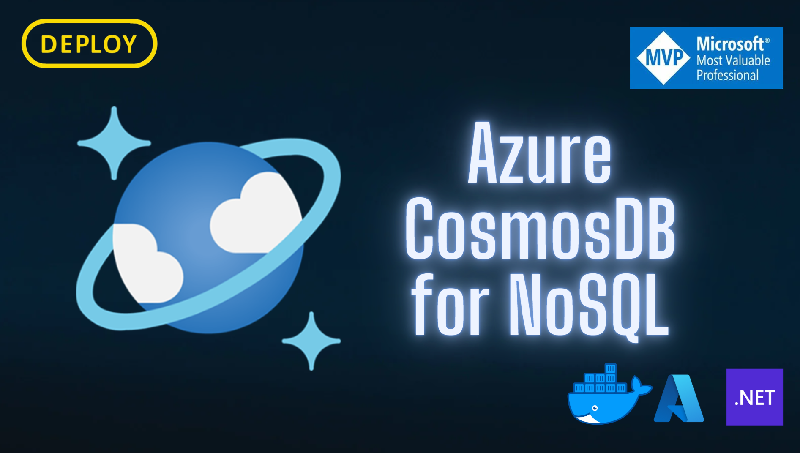

> [!NOTE]
> O conteúdo técnico deste repositório é baseado em experiências práticas e documentações oficiais da Microsoft. O objetivo é compartilhar conhecimento com a comunidade técnica.

> [!TIP]
> :star2: Considere dar uma estrela para este repositório! :star2:

> [!IMPORTANT]
> Caso tenha alguma dúvida ou sugestão, por favor, abra uma issue.

> [!WARNING]
> Não utilize este repositório em produção.

> [!CAUTION]
> Não se esqueça de ler a documentação oficial da Microsoft.

## URL do Emulador do CosmosDB

```
https://learn.microsoft.com/en-us/azure/cosmos-db/emulator
```

## Executar o Emulador do CosmosDB

```
docker run \
--publish 8081:8081 \
--publish 10250-10255:10250-10255 \
--name canal-deploy-cosmos-emulator \
--detach \
mcr.microsoft.com/cosmosdb/linux/azure-cosmos-emulator:latest
```

## URL do Emulador

```
https://localhost:8081/_explorer/index.html
```

## Calculadora

```
https://cosmos.azure.com/capacitycalculator/
```

## Painel para CosmosDB Online

```
https://cosmos.azure.com/
```
